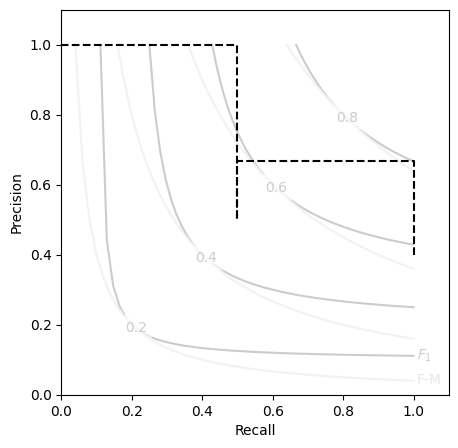

# Tutorial

Binary classification metrics are all about testing the quality of your
predicted labels against the _actual_ labels you observed.

To start out, we will need example _predictions_ (`y_pred`) and _targets_ (`y_true`).

??? info "python imports & setup"

    ```ipython
    import numpy as np
    from rich import print
    import matplotlib.pyplot as plt

    np.set_printoptions(formatter={'float_kind':"{:.5g}".format})
    ```

```ipython
y_true = np.array([0,1,0,0,1]).astype(bool)
y_pred = np.array([0,1,0,1,0]).astype(bool)
```

## Basic Instantiation

Now, just instantiate the [`Contingent`][contingency.contingent.Contingent] dataclass with your true and predicted target values.

```ipython
from contingency import Contingent
M = Contingent(y_pred=y_pred, y_true=y_true)
    
print(M)
```

??? example "output"
    <pre style="white-space:pre;overflow-x:auto;line-height:normal;font-family:Menlo,'DejaVu Sans Mono',consolas,'Courier New',monospace"><span style="color: #800080; text-decoration-color: #800080; font-weight: bold">Contingent</span><span style="font-weight: bold">(</span>
        <span style="color: #808000; text-decoration-color: #808000">y_true</span>=<span style="color: #800080; text-decoration-color: #800080; font-weight: bold">array</span><span style="font-weight: bold">([[</span><span style="color: #ff0000; text-decoration-color: #ff0000; font-style: italic">False</span>,  <span style="color: #00ff00; text-decoration-color: #00ff00; font-style: italic">True</span>, <span style="color: #ff0000; text-decoration-color: #ff0000; font-style: italic">False</span>, <span style="color: #ff0000; text-decoration-color: #ff0000; font-style: italic">False</span>,  <span style="color: #00ff00; text-decoration-color: #00ff00; font-style: italic">True</span><span style="font-weight: bold">]])</span>,
        <span style="color: #808000; text-decoration-color: #808000">y_pred</span>=<span style="color: #800080; text-decoration-color: #800080; font-weight: bold">array</span><span style="font-weight: bold">([[</span><span style="color: #ff0000; text-decoration-color: #ff0000; font-style: italic">False</span>,  <span style="color: #00ff00; text-decoration-color: #00ff00; font-style: italic">True</span>, <span style="color: #ff0000; text-decoration-color: #ff0000; font-style: italic">False</span>,  <span style="color: #00ff00; text-decoration-color: #00ff00; font-style: italic">True</span>, <span style="color: #ff0000; text-decoration-color: #ff0000; font-style: italic">False</span><span style="font-weight: bold">]])</span>,
        <span style="color: #808000; text-decoration-color: #808000">weights</span>=<span style="color: #800080; text-decoration-color: #800080; font-style: italic">None</span>,
        <span style="color: #808000; text-decoration-color: #808000">TP</span>=<span style="color: #800080; text-decoration-color: #800080; font-weight: bold">array</span><span style="font-weight: bold">([</span><span style="color: #008080; text-decoration-color: #008080; font-weight: bold">1</span><span style="font-weight: bold">])</span>,
        <span style="color: #808000; text-decoration-color: #808000">FP</span>=<span style="color: #800080; text-decoration-color: #800080; font-weight: bold">array</span><span style="font-weight: bold">([</span><span style="color: #008080; text-decoration-color: #008080; font-weight: bold">1</span><span style="font-weight: bold">])</span>,
        <span style="color: #808000; text-decoration-color: #808000">FN</span>=<span style="color: #800080; text-decoration-color: #800080; font-weight: bold">array</span><span style="font-weight: bold">([</span><span style="color: #008080; text-decoration-color: #008080; font-weight: bold">1</span><span style="font-weight: bold">])</span>,
        <span style="color: #808000; text-decoration-color: #808000">TN</span>=<span style="color: #800080; text-decoration-color: #800080; font-weight: bold">array</span><span style="font-weight: bold">([</span><span style="color: #008080; text-decoration-color: #008080; font-weight: bold">2</span><span style="font-weight: bold">])</span>,
        <span style="color: #808000; text-decoration-color: #808000">PP</span>=<span style="color: #800080; text-decoration-color: #800080; font-weight: bold">array</span><span style="font-weight: bold">([</span><span style="color: #008080; text-decoration-color: #008080; font-weight: bold">2</span><span style="font-weight: bold">])</span>,
        <span style="color: #808000; text-decoration-color: #808000">PN</span>=<span style="color: #800080; text-decoration-color: #800080; font-weight: bold">array</span><span style="font-weight: bold">([</span><span style="color: #008080; text-decoration-color: #008080; font-weight: bold">3</span><span style="font-weight: bold">])</span>,
        <span style="color: #808000; text-decoration-color: #808000">P</span>=<span style="color: #800080; text-decoration-color: #800080; font-weight: bold">array</span><span style="font-weight: bold">([</span><span style="color: #008080; text-decoration-color: #008080; font-weight: bold">2</span><span style="font-weight: bold">])</span>,
        <span style="color: #808000; text-decoration-color: #808000">N</span>=<span style="color: #800080; text-decoration-color: #800080; font-weight: bold">array</span><span style="font-weight: bold">([</span><span style="color: #008080; text-decoration-color: #008080; font-weight: bold">3</span><span style="font-weight: bold">])</span>,
        <span style="color: #808000; text-decoration-color: #808000">PPV</span>=<span style="color: #800080; text-decoration-color: #800080; font-weight: bold">masked_array</span><span style="font-weight: bold">(</span><span style="color: #808000; text-decoration-color: #808000">data</span>=<span style="font-weight: bold">[</span><span style="color: #008080; text-decoration-color: #008080; font-weight: bold">0.5</span><span style="font-weight: bold">]</span>,
                 <span style="color: #808000; text-decoration-color: #808000">mask</span>=<span style="font-weight: bold">[</span><span style="color: #ff0000; text-decoration-color: #ff0000; font-style: italic">False</span><span style="font-weight: bold">]</span>,
           <span style="color: #808000; text-decoration-color: #808000">fill_value</span>=<span style="color: #008080; text-decoration-color: #008080; font-weight: bold">1e+20</span><span style="font-weight: bold">)</span>,
        <span style="color: #808000; text-decoration-color: #808000">NPV</span>=<span style="color: #800080; text-decoration-color: #800080; font-weight: bold">masked_array</span><span style="font-weight: bold">(</span><span style="color: #808000; text-decoration-color: #808000">data</span>=<span style="font-weight: bold">[</span><span style="color: #008080; text-decoration-color: #008080; font-weight: bold">0.6666666666666666</span><span style="font-weight: bold">]</span>,
                 <span style="color: #808000; text-decoration-color: #808000">mask</span>=<span style="font-weight: bold">[</span><span style="color: #ff0000; text-decoration-color: #ff0000; font-style: italic">False</span><span style="font-weight: bold">]</span>,
           <span style="color: #808000; text-decoration-color: #808000">fill_value</span>=<span style="color: #008080; text-decoration-color: #008080; font-weight: bold">1e+20</span><span style="font-weight: bold">)</span>,
        <span style="color: #808000; text-decoration-color: #808000">TPR</span>=<span style="color: #800080; text-decoration-color: #800080; font-weight: bold">masked_array</span><span style="font-weight: bold">(</span><span style="color: #808000; text-decoration-color: #808000">data</span>=<span style="font-weight: bold">[</span><span style="color: #008080; text-decoration-color: #008080; font-weight: bold">0.5</span><span style="font-weight: bold">]</span>,
                 <span style="color: #808000; text-decoration-color: #808000">mask</span>=<span style="font-weight: bold">[</span><span style="color: #ff0000; text-decoration-color: #ff0000; font-style: italic">False</span><span style="font-weight: bold">]</span>,
           <span style="color: #808000; text-decoration-color: #808000">fill_value</span>=<span style="color: #008080; text-decoration-color: #008080; font-weight: bold">1e+20</span><span style="font-weight: bold">)</span>,
        <span style="color: #808000; text-decoration-color: #808000">TNR</span>=<span style="color: #800080; text-decoration-color: #800080; font-weight: bold">masked_array</span><span style="font-weight: bold">(</span><span style="color: #808000; text-decoration-color: #808000">data</span>=<span style="font-weight: bold">[</span><span style="color: #008080; text-decoration-color: #008080; font-weight: bold">0.6666666666666666</span><span style="font-weight: bold">]</span>,
                 <span style="color: #808000; text-decoration-color: #808000">mask</span>=<span style="font-weight: bold">[</span><span style="color: #ff0000; text-decoration-color: #ff0000; font-style: italic">False</span><span style="font-weight: bold">]</span>,
           <span style="color: #808000; text-decoration-color: #808000">fill_value</span>=<span style="color: #008080; text-decoration-color: #008080; font-weight: bold">1e+20</span><span style="font-weight: bold">)</span>
    <span style="font-weight: bold">)</span>
    </pre>

We now have access to properties that will return useful metrics from these contingency counts, such as:

- [Matthew's Correlation Coefficient](https://en.wikipedia.org/wiki/Phi_coefficient) (MCC)
- [F1/F2](https://en.wikipedia.org/wiki/F-score) scores
- [Fowlkes-Mallows](https://en.wikipedia.org/wiki/Fowlkes%E2%80%93Mallows_index) (G) index
- and more (see the [API](../api/contingent.md))

```ipython
print(M.mcc, M.F, M.G, sep='\n')

```

<pre style="white-space:pre;overflow-x:auto;line-height:normal;font-family:Menlo,'DejaVu Sans Mono',consolas,'Courier New',monospace"><span style="font-weight: bold">[</span><span style="color: #008080; text-decoration-color: #008080; font-weight: bold">0.16667</span><span style="font-weight: bold">]</span>
<span style="font-weight: bold">[</span><span style="color: #008080; text-decoration-color: #008080; font-weight: bold">0.5</span><span style="font-weight: bold">]</span>
<span style="font-weight: bold">[</span><span style="color: #008080; text-decoration-color: #008080; font-weight: bold">0.5</span><span style="font-weight: bold">]</span>
</pre>

## Contingencies from Probabilities

Most ML systems do not output binary classifications directly, but instead output probabilities or weights.

```ipython
y_prob = np.array([0.1,0.8,0.1,.7,.25])
```

Thresholding these will create an entire "family" of predictions as the threshold increases or lowers.

[`Contingent`][contingency.contingent.Contingent] easily handles this as a simple broadcasting operation, using [`numpy`](https://numpy.org/).
To access this functionality, produce a [`Contingent`][contingency.contingent.Contingent] instance  using the [`from_scalar()`][contingency.contingent.Contingent.from_scalar] constructor with you scalar predictions:

```ipython
M_batch = Contingent.from_scalar(y_true, y_prob)
print(M_batch.weights, M_batch.y_pred, sep='\n')

M_batch.y_pred.shape
```

<pre style="white-space:pre;overflow-x:auto;line-height:normal;font-family:Menlo,'DejaVu Sans Mono',consolas,'Courier New',monospace"><span style="font-weight: bold">[</span><span style="color: #008080; text-decoration-color: #008080; font-weight: bold">0</span> <span style="color: #008080; text-decoration-color: #008080; font-weight: bold">1e-05</span> <span style="color: #008080; text-decoration-color: #008080; font-weight: bold">0.21429</span> <span style="color: #008080; text-decoration-color: #008080; font-weight: bold">0.85714</span> <span style="color: #008080; text-decoration-color: #008080; font-weight: bold">0.99999</span> <span style="color: #008080; text-decoration-color: #008080; font-weight: bold">1</span><span style="font-weight: bold">]</span>
<span style="font-weight: bold">[[</span> <span style="color: #00ff00; text-decoration-color: #00ff00; font-style: italic">True</span>  <span style="color: #00ff00; text-decoration-color: #00ff00; font-style: italic">True</span>  <span style="color: #00ff00; text-decoration-color: #00ff00; font-style: italic">True</span>  <span style="color: #00ff00; text-decoration-color: #00ff00; font-style: italic">True</span>  <span style="color: #00ff00; text-decoration-color: #00ff00; font-style: italic">True</span><span style="font-weight: bold">]</span>
 <span style="font-weight: bold">[</span> <span style="color: #00ff00; text-decoration-color: #00ff00; font-style: italic">True</span>  <span style="color: #00ff00; text-decoration-color: #00ff00; font-style: italic">True</span>  <span style="color: #00ff00; text-decoration-color: #00ff00; font-style: italic">True</span>  <span style="color: #00ff00; text-decoration-color: #00ff00; font-style: italic">True</span>  <span style="color: #00ff00; text-decoration-color: #00ff00; font-style: italic">True</span><span style="font-weight: bold">]</span>
 <span style="font-weight: bold">[</span><span style="color: #ff0000; text-decoration-color: #ff0000; font-style: italic">False</span>  <span style="color: #00ff00; text-decoration-color: #00ff00; font-style: italic">True</span> <span style="color: #ff0000; text-decoration-color: #ff0000; font-style: italic">False</span>  <span style="color: #00ff00; text-decoration-color: #00ff00; font-style: italic">True</span>  <span style="color: #00ff00; text-decoration-color: #00ff00; font-style: italic">True</span><span style="font-weight: bold">]</span>
 <span style="font-weight: bold">[</span><span style="color: #ff0000; text-decoration-color: #ff0000; font-style: italic">False</span>  <span style="color: #00ff00; text-decoration-color: #00ff00; font-style: italic">True</span> <span style="color: #ff0000; text-decoration-color: #ff0000; font-style: italic">False</span>  <span style="color: #00ff00; text-decoration-color: #00ff00; font-style: italic">True</span> <span style="color: #ff0000; text-decoration-color: #ff0000; font-style: italic">False</span><span style="font-weight: bold">]</span>
 <span style="font-weight: bold">[</span><span style="color: #ff0000; text-decoration-color: #ff0000; font-style: italic">False</span>  <span style="color: #00ff00; text-decoration-color: #00ff00; font-style: italic">True</span> <span style="color: #ff0000; text-decoration-color: #ff0000; font-style: italic">False</span> <span style="color: #ff0000; text-decoration-color: #ff0000; font-style: italic">False</span> <span style="color: #ff0000; text-decoration-color: #ff0000; font-style: italic">False</span><span style="font-weight: bold">]</span>
 <span style="font-weight: bold">[</span><span style="color: #ff0000; text-decoration-color: #ff0000; font-style: italic">False</span> <span style="color: #ff0000; text-decoration-color: #ff0000; font-style: italic">False</span> <span style="color: #ff0000; text-decoration-color: #ff0000; font-style: italic">False</span> <span style="color: #ff0000; text-decoration-color: #ff0000; font-style: italic">False</span> <span style="color: #ff0000; text-decoration-color: #ff0000; font-style: italic">False</span><span style="font-weight: bold">]]</span>
</pre>

    (6, 5)

Note how the number of positives decreases as the threshold increases (downward, increasing with each row).

Likewise, we can see that the set of metrics is now vectorized as well, since each threshold implies a different set of TP,FP, FN, and TN counts:

```ipython
print(M_batch.mcc, M_batch.F, M_batch.G, sep='\n')
```

<pre style="white-space:pre;overflow-x:auto;line-height:normal;font-family:Menlo,'DejaVu Sans Mono',consolas,'Courier New',monospace"><span style="font-weight: bold">[</span><span style="color: #008080; text-decoration-color: #008080; font-weight: bold">0</span> <span style="color: #008080; text-decoration-color: #008080; font-weight: bold">0</span> <span style="color: #008080; text-decoration-color: #008080; font-weight: bold">0.66667</span> <span style="color: #008080; text-decoration-color: #008080; font-weight: bold">0.16667</span> <span style="color: #008080; text-decoration-color: #008080; font-weight: bold">0.61237</span> <span style="color: #008080; text-decoration-color: #008080; font-weight: bold">0</span><span style="font-weight: bold">]</span>
<span style="font-weight: bold">[</span><span style="color: #008080; text-decoration-color: #008080; font-weight: bold">0.57143</span> <span style="color: #008080; text-decoration-color: #008080; font-weight: bold">0.57143</span> <span style="color: #008080; text-decoration-color: #008080; font-weight: bold">0.8</span> <span style="color: #008080; text-decoration-color: #008080; font-weight: bold">0.5</span> <span style="color: #008080; text-decoration-color: #008080; font-weight: bold">0.66667</span> <span style="color: #008080; text-decoration-color: #008080; font-weight: bold">0</span><span style="font-weight: bold">]</span>
<span style="font-weight: bold">[</span><span style="color: #008080; text-decoration-color: #008080; font-weight: bold">0.63246</span> <span style="color: #008080; text-decoration-color: #008080; font-weight: bold">0.63246</span> <span style="color: #008080; text-decoration-color: #008080; font-weight: bold">0.8165</span> <span style="color: #008080; text-decoration-color: #008080; font-weight: bold">0.5</span> <span style="color: #008080; text-decoration-color: #008080; font-weight: bold">0.70711</span> <span style="color: #008080; text-decoration-color: #008080; font-weight: bold">0</span><span style="font-weight: bold">]</span>
</pre>

## Expected Values

We would like a single score that summarizes our classifier's performance across _all_ thresholds.

This can traditionally be done using [Average Precision Score](https://en.wikipedia.org/w/index.php?title=Information_retrieval&oldid=793358396#Average_precision) (APS), which is the average precision weighted across the _recall_ scores.
Alternatively, [`Contingent.expected`][contingency.contingent.Contingent.expected] can calculate the expected value of each provided score type across the set of unique threshold values.

```ipython
for score in ('aps', 'mcc', 'F'):
    print(M_batch.expected(score))
```

<pre style="white-space:pre;overflow-x:auto;line-height:normal;font-family:Menlo,'DejaVu Sans Mono',consolas,'Courier New',monospace"><span style="color: #008080; text-decoration-color: #008080; font-weight: bold">0.8333333333333333</span>
</pre>

<pre style="white-space:pre;overflow-x:auto;line-height:normal;font-family:Menlo,'DejaVu Sans Mono',consolas,'Courier New',monospace"><span style="color: #008080; text-decoration-color: #008080; font-weight: bold">0.39492652768935094</span>
</pre>

<pre style="white-space:pre;overflow-x:auto;line-height:normal;font-family:Menlo,'DejaVu Sans Mono',consolas,'Courier New',monospace"><span style="color: #008080; text-decoration-color: #008080; font-weight: bold">0.6481253367346939</span>
</pre>

## Optional Plotting Utilities

For those of us that are consistently performing threshold sensitivity analyses, a _Precision-Recall_ (P-R) curve probably feels like an old friend.
Communicating these with respect to the aggregate scores like [`F`][contingency.contingent.f_beta] and [`G`][contingency.contingent.fowlkes_mallows] can be tricky, so we've provided a simple template `matplotlib.axes.Axes` object.
You can access this template by importing the included plot utility [`PR_contour`][contingency.plots.PR_contour] for making nicely formatted P-R curve axes to plot your [`Contingent`][contingency.contingent.Contingent] metrics on.

```ipython
from contingency.plots import PR_contour

M_batch.expected('aps')
plt.figure(figsize=(5,5))
PR_contour()
plt.step(M_batch.recall, M_batch.precision, color='k', ls='--', where='post')
```



!!! tip
    While the [`Contingent`][contingency.contingent.Contingent] class does not have a method to automatically plot its own P-R curves on a contour like this, such functionality is planned to be added at a later time.
