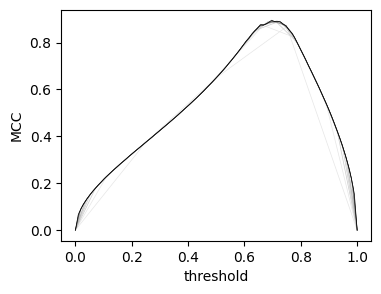
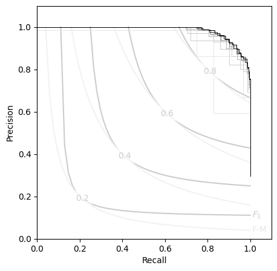

# Performance
When datasets become increasingly large, the number of unique thresholds can grow significantly. 

## Vectorize & Memoize
Because looping in python is slow, we rely on boolean matrix operations to calculate the contingency counts. At the core of `Contingent.from_scalar` is a call to `numpy.less_equal.outer()`, which broadcasts the thresholding operation over all possible levels simultaneously. 

This is reasonably fast, able to calculate e.g. APS only marginally slower than the scikit-learn implementation.
In addition, the one-time cacluation of the "full" contingency set has the added benefit of amortizing the cost of subsequent metric calculations significantly. 


```ipython
rng = np.random.default_rng(24) ## mph, the avg cruising airspeed velocity of an unladen (european) swallow
y_src = rng.random(1000)
y_true = y_src>0.7

y_pred = y_src + 0.05*rng.normal(size=1000)
```


```ipython
from sklearn.metrics import average_precision_score, matthews_corrcoef
%timeit average_precision_score(y_true, y_pred)
%timeit Contingent.from_scalar(y_true, y_pred).expected('aps')

Mbig = Contingent.from_scalar(y_true, y_pred)
%timeit Mbig.expected('aps')
```

    1.07 ms ± 231 μs per loop (mean ± std. dev. of 7 runs, 1,000 loops each)
    2.83 ms ± 55.4 μs per loop (mean ± std. dev. of 7 runs, 100 loops each)
    30.3 μs ± 341 ns per loop (mean ± std. dev. of 7 runs, 10,000 loops each)


This means that with a signle `Contingent` object, all of the various metrics can be calculated from then on, in mere microseconds. 

In addition, when scikit-learn does not have optimized aggregation functions, `Contingent` can continue on just as well. 
Say you wish to find the expected value of the MCC score over all thresholds: 


```ipython
%timeit np.mean([matthews_corrcoef(y_true,x) for x in Mbig.y_pred])
%timeit M1000.expected('mcc')
```

    1.36 s ± 576 ms per loop (mean ± std. dev. of 7 runs, 1 loop each)
    176 μs ± 10.9 μs per loop (mean ± std. dev. of 7 runs, 10,000 loops each)


## Subsampling Approximation

The limit to this amortization comes from your RAM: the outer-product matrix can get huge. 
To mitigate this, `Contingent.from_scalar` has a `subsamples` option, wich allows you to approximate the threshold values with an interpolated subset, distributed according to the originals. 

With only a few subsamples, the score curves quickly converge to their "true" values. 


```ipython

# rng.normal(
plt.figure(figsize=(4,3))
for subs in (5,10,15, 20, 25, 30,50,75,100): 
    plt.plot(
        np.linspace(0,1,subs),
        (Contingent.from_scalar(y_true, y_pred, subsamples=subs)).mcc,
        lw=0.5, color=f'{1-subs/100:.1f}'
    )
plt.ylabel('MCC')
plt.xlabel('threshold');
```


    

    


Likewise, the P-R curves: 


```ipython
plt.figure(figsize=(5,5))
PR_contour()

for subs in (5,10,15, 20, 25, 30,50,75,100): 
    Msubs = Contingent.from_scalar(y_true, y_pred, subsamples=subs)
   
    plt.step(Msubs.recall, Msubs.precision, lw=0.7, color=f'{1-subs/100:.1f}', where='post')
```


    

    


This allows `Contingent` objects to handle some quite large data-sets:  


```ipython
y_src = rng.random(int(1e6))
y_true = y_src>0.7

y_pred = y_src + 0.05*rng.normal(size=int(1e6))
# from sklearn.metrics import average_precision_score, matthews_corrcoef
%timeit average_precision_score(y_true, y_pred)
%timeit Contingent.from_scalar(y_true, y_pred, subsamples=200)

M200 = Contingent.from_scalar(y_true, y_pred, subsamples=200)

%timeit M200.expected('aps')

```

    511 ms ± 21 ms per loop (mean ± std. dev. of 7 runs, 1 loop each)
    678 ms ± 203 ms per loop (mean ± std. dev. of 7 runs, 1 loop each)
    28 μs ± 411 ns per loop (mean ± std. dev. of 7 runs, 10,000 loops each)


```ipython
print(
    '{:.4g}'.format(average_precision_score(y_true, y_pred)), 
    '{:.4g}'.format(M200.expected('aps'))
)
```


<pre style="white-space:pre;overflow-x:auto;line-height:normal;font-family:Menlo,'DejaVu Sans Mono',consolas,'Courier New',monospace"><span style="color: #008080; text-decoration-color: #008080; font-weight: bold">0.9865</span> <span style="color: #008080; text-decoration-color: #008080; font-weight: bold">0.9858</span>
</pre>


