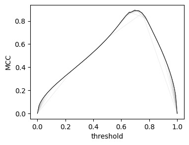
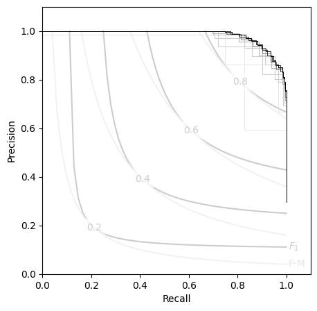

# Performance

When datasets become increasingly large, the number of unique thresholds can grow significantly.
To maximize performance, we rely on [`numpy`](https://numpy.org/)'s ["broadcasting" feature](https://numpy.org/doc/2.4/user/basics.broadcasting.html) to perform operations using its C-backend, rather than Python.

## Vectorize & Memoize

Because looping in python is slow, we rely on boolean matrix operations to calculate the contingency counts. At the core of [`Contingent.from_scalar`][contingency.contingent.Contingent.from_scalar] is a call to [`numpy.less_equal.outer`](https://numpy.org/doc/stable/reference/generated/numpy.ufunc.outer.html), which broadcasts the thresholding operation over all possible levels simultaneously.

This is reasonably fast, able to calculate e.g. APS only marginally slower than the [scikit-learn implementation](https://scikit-learn.org/stable/modules/generated/sklearn.metrics.average_precision_score.html).
In addition, the one-time calculation of the "full" contingency set has the added benefit of amortizing the cost of subsequent metric calculations significantly.

Let's make a much larger test case than before, by adding white noise to a known ground-truth.

```ipython
rng = np.random.default_rng(24) # (1)! 
y_src = rng.random(1000)
y_true = y_src>0.7

y_pred = y_src + 0.05*rng.normal(size=1000)
```

1. Did you know? 24mph is the cruising airspeed velocity of an unladen (european) swallow

```ipython
from sklearn.metrics import average_precision_score, matthews_corrcoef
%timeit average_precision_score(y_true, y_pred)
%timeit Contingent.from_scalar(y_true, y_pred).expected('aps')

Mbig = Contingent.from_scalar(y_true, y_pred)
%timeit Mbig.expected('aps')
```

    1.07 ms ± 231 μs per loop (mean ± std. dev. of 7 runs, 1,000 loops each)
    2.83 ms ± 55.4 μs per loop (mean ± std. dev. of 7 runs, 100 loops each)
    30.3 μs ± 341 ns per loop (mean ± std. dev. of 7 runs, 10,000 loops each)

This means that, with a single [`Contingent`][contingency.contingent.Contingent] object, all of the various metrics can be calculated from then on in mere microseconds.

And when `scikit-learn` does not have optimized aggregation functions, [`Contingent`][contingency.contingent.Contingent] can continue on just as well.
Say you wish to find the expected value of the MCC score over all thresholds; using a [`Contingent`][contingency.contingent.Contingent] object results in an order of magnitude speed increase.

```ipython
%timeit np.mean([matthews_corrcoef(y_true,x) for x in Mbig.y_pred])
%timeit M1000.expected('mcc')
```

    1.36 s ± 576 ms per loop (mean ± std. dev. of 7 runs, 1 loop each)
    176 μs ± 10.9 μs per loop (mean ± std. dev. of 7 runs, 10,000 loops each)

!!! tip

    This is one of the key features of `contingency`!
    
    If you have many individual datasets or runs, and you want to compare cross-threshold metrics (like APS) over many experiments, needing over a second per-run can add up quickly!
    This is a common problem in feature engineering and model selection pipelines.

    For an example, see the [MENDR benchmark](https://github.com/usnistgov/mendr), where tens of thousands of individual prediction arrays need to be systematically compared via APS and expected MCC.
    Using the mean of many [`matthews_corrcoef`](https://scikit-learn.org/stable/modules/generated/sklearn.metrics.matthews_corrcoef.html#sklearn.metrics.matthews_corrcoef) calls would take a very long time, if not for the optimizations made by `contingency`!

## Subsampling Approximation

The limit to this amortization comes from your RAM: the outer-product matrix we use to vectorize contingency counting can get _huge_.

To mitigate this, [`Contingent.from_scalar`][contingency.contingent.Contingent.from_scalar] has a `subsamples` option which allows you to approximate the threshold values with an interpolated subset distributed according to the originals.

With only a few subsamples, the score curves quickly converge to their "true" values.

```ipython

# rng.normal(
plt.figure(figsize=(4,3))
for subs in (5,10,15, 20, 25, 30,50,75,100): 
    plt.plot(
        np.linspace(0,1,subs),
        (Contingent.from_scalar(y_true, y_pred, subsamples=subs)).mcc,
        lw=0.5, color=f'{1-subs/100:.1f}'
    )
plt.ylabel('MCC')
plt.xlabel('threshold');
```



Likewise, the P-R curves:

```ipython
plt.figure(figsize=(5,5))
PR_contour()

for subs in (5,10,15, 20, 25, 30,50,75,100): 
    Msubs = Contingent.from_scalar(y_true, y_pred, subsamples=subs)
    plt.step(Msubs.recall, Msubs.precision, lw=0.7, color=f'{1-subs/100:.1f}', where='post')
```



This allows [`Contingent`][contingency.contingent.Contingent] objects to handle some quite large datasets:  

```ipython
y_src = rng.random(int(1e6))
y_true = y_src>0.7

y_pred = y_src + 0.05*rng.normal(size=int(1e6))
# from sklearn.metrics import average_precision_score, matthews_corrcoef
%timeit average_precision_score(y_true, y_pred)
%timeit Contingent.from_scalar(y_true, y_pred, subsamples=200)

M200 = Contingent.from_scalar(y_true, y_pred, subsamples=200)

%timeit M200.expected('aps')

```

    511 ms ± 21 ms per loop (mean ± std. dev. of 7 runs, 1 loop each)
    678 ms ± 203 ms per loop (mean ± std. dev. of 7 runs, 1 loop each)
    28 μs ± 411 ns per loop (mean ± std. dev. of 7 runs, 10,000 loops each)

```ipython
print(
    '{:.4g}'.format(average_precision_score(y_true, y_pred)), 
    '{:.4g}'.format(M200.expected('aps'))
)
```

<pre style="white-space:pre;overflow-x:auto;line-height:normal;font-family:Menlo,'DejaVu Sans Mono',consolas,'Courier New',monospace"><span style="color: #008080; text-decoration-color: #008080; font-weight: bold">0.9865</span> <span style="color: #008080; text-decoration-color: #008080; font-weight: bold">0.9858</span>
</pre>
